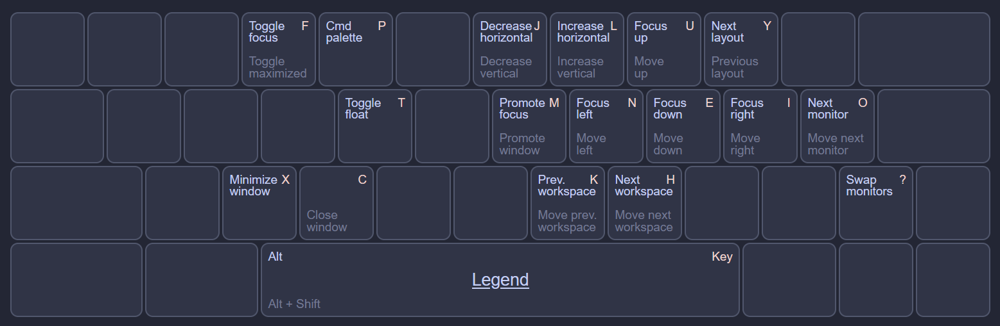
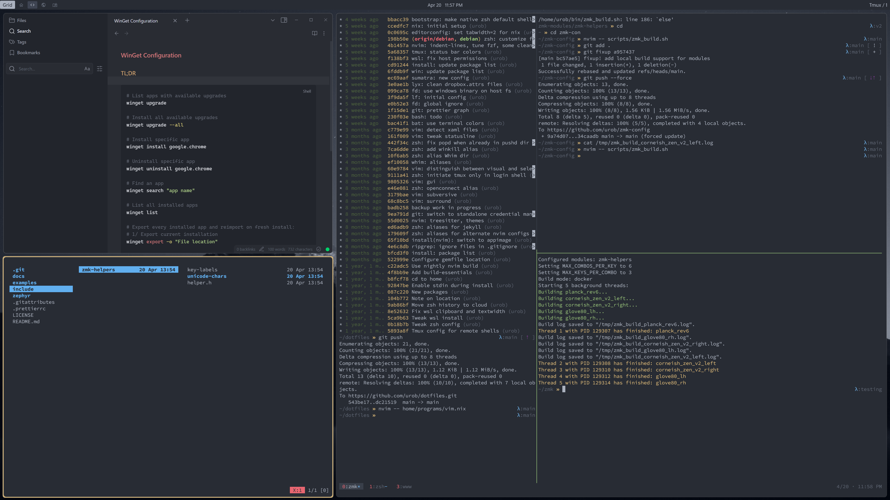

# urob's whim-config

This is my personal [Whim](https://github.com/dalyIsaac/Whim) configuration. I sometimes use features that are not (yet) part of the official release. My personal [Whim dev](https://github.com/urob/Whim/tree/dev) repo will contain all needed features in those cases.

## Key bindings

My keybind configuration is intended to be used on a Colemak keyboard layout. Here's a reference chart:



## Useful stuff

- streamlined keybinds with `Bind(mod1, "P", "whim.command_palette.toggle");`
- icon labels for workspaces in status bar
- binds to cycle over workspaces, skipping those that are active on any monitor
- binds to swap monitors
- `Alt + F` unmaximizes and toggles focus layout, `Shift + Alt + F` maximizes if focus layout isn't active and otherwise toggles maximize

## Icons in the workspace viewer

For the icons to work one must install a [Nerd Font](https://www.nerdfonts.com/) and use it for the Workspace widget. Here's the relevant line in my `bar.resources.xaml`:
```cs
<Style x:Key="bar:workspace:button" TargetType="Button">
    <Setter Property="FontFamily" Value="Ubuntu Nerd Font Propo" />
</Style>
```
With [Scoop](https://scoop.sh/) the font I use can be installed as follows:
```powershell
# Add a bucket for the nerd-fonts
scoop bucket add nerd-fonts

# Install the patched Ubuntu font
scoop install Ubuntu-NF-Propo
```

## ... and this is how it looks


